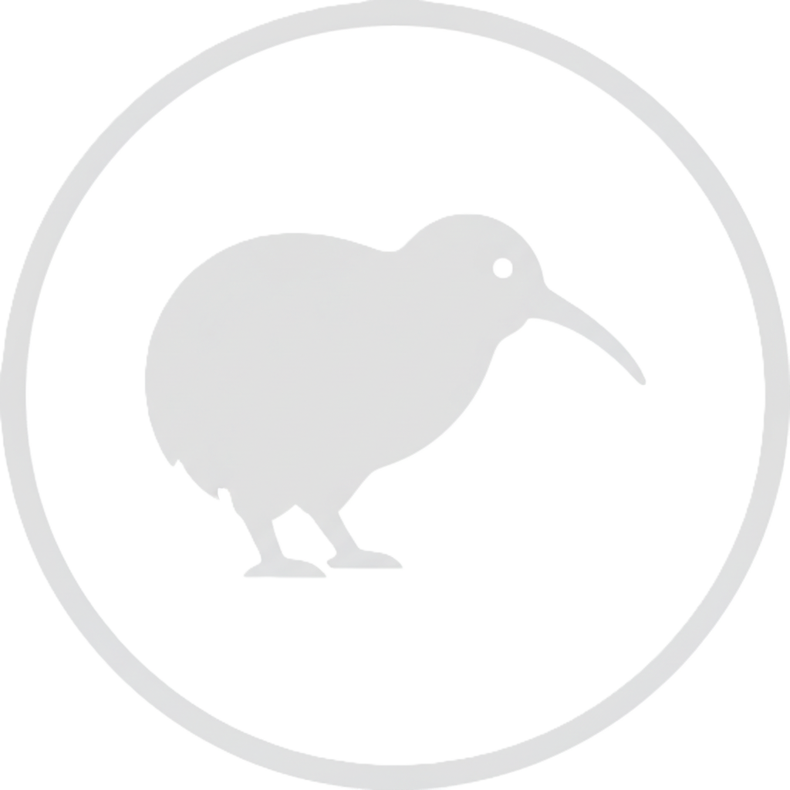

  

# Kiwi Free IPTV

A high-performance, unified solution for streaming free-to-air New Zealand TV. This repository contains both a **Stremio Addon** and a premium **Web Player**, all powered by a single blazingly fast Rust backend.

## 🚀 One Backend, Two Experiences

We provide a consistent and lightning-fast experience for streaming free-to-air New Zealand TV through either a Web Player or a Stremio addon.

### 1. 📺 Stremio Addon
A native Stremio integration that provides rich metadata, landscape posters, and reliable streaming to any Stremio-capable device.
- **Rich EPG**: Instant updates for currently airing programs on the Discover pane.
- **Smart Sorting**: Channels ordered to match the official NZ Freeview layout.
- **Enhanced Metadata**: IMDb ratings, genres, and age classifications.

### 2. 📱 TV Web Application
A sleek, modern web interface optimized for both desktop and mobile/PWA usage.
- **Premium UI**: Dark-mode focused, glassmorphic design with smooth micro-animations.
- **Integrated Player**: Custom HLS player with adaptive quality and picture-in-picture.
- **Zero Bloat**: Consumed pre-processed data from the Rust backend, eliminating browser-side XML parsing.

---

## 🌍 Region Locking

> [!IMPORTANT]
> The following channels are **region-locked** and will only function if your IP address is within **New Zealand**:
> - **Three**
> - **Bravo**
> - **The Edge TV**
> 
> If you are outside of New Zealand, a **VPN** connected to a New Zealand server is required to stream these channels.

---

## 🛠️ Technology Stack

- **Backend (Rust)**: Powered by `axum`, `tokio`, and `moka` for instantaneous metadata processing and native stream proxying.
- **Frontend (React)**: Built with [React 19](https://react.dev/) and [Vite 8](https://vite.dev/).
- **Styling**: [Tailwind CSS 4](https://tailwindcss.com/) with modern glassmorphic aesthetics.
- **Streaming**: [hls.js](https://github.com/video-dev/hls.js).
- **Persistence**: [IndexedDB](https://developer.mozilla.org/en-US/docs/Web/API/IndexedDB_API) for persistent image and stream metadata caching.

---

### 4. 🙏 Credits & Acknowledgments

- **Matt Huisman**: Huge thanks to [Matt Huisman](https://www.matthuisman.nz/) for providing the raw IPTV playlists and EPG data. This project would not be possible without his brilliant work.
- **Stremio**: For the incredible addon framework.

---

### 5. 📝 License

This project is open-source and licensed under the [MIT License](LICENSE).